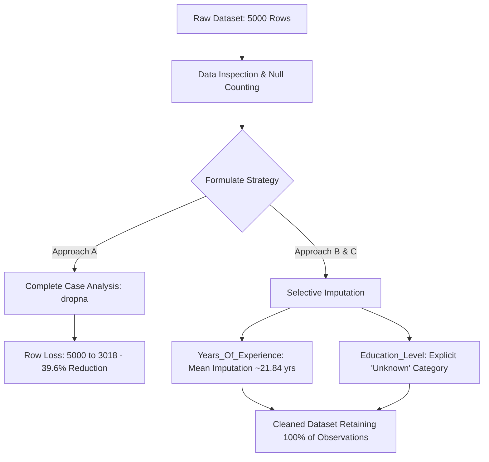

# 📊 Data Science Development: Data Wrangling & Analysis

[](https://www.python.org/)
[](https://pandas.pydata.org/)
[](https://jupyter.org/)
[](https://opensource.org/licenses/MIT)

A structured data science repository exploring **data wrangling**, **exploratory data analysis (EDA)**, and **missing data handling methodologies** focused on socio-economic and public health datasets across Nigeria.

---

## 🍽️ The Core Philosophy: *The Data Kitchen & The Data Chef*

In data science, raw data rarely arrives clean, balanced, and ready for modeling. Just as a professional chef cannot cook unwashed, uninspected, or poorly measured ingredients straight from the market:

- **Raw Ingredients = Raw Data**: Datasets often contain missing fields ("rot/spoilage"), inconsistent measurement units (e.g., Imperial vs. Metric), and formatting discrepancies.
- **The Data Chef = The Data Scientist**: Responsible for inspecting every feature, assessing data hygiene, understanding *why* anomalies exist, and applying principled cleaning and imputation techniques before analytical modeling.

---

## 📁 Repository Structure

```text
├── day-1-data-wrangling.ipynb                # Primary notebook: Ingestion, inspection, and missing data strategies
├── nigeria_unemployment_missing_data.csv     # Employment survey dataset with missing records (5,000 rows)
├── nigeria_economic_data.csv                 # Detailed socioeconomic and poverty level dataset (10,000 rows)
├── nigeria_nursing_mothers_healthcare.csv    # Maternal healthcare access & immunization metrics (10,000 rows)
├── .gitignore                                # Standard git ignore rules for Python & Jupyter artifacts
└── README.md                                 # Project documentation and workflow log
```

---

## 📊 Datasets Overview

### 1. `nigeria_unemployment_missing_data.csv` (5,000 Records)
Focuses on demographic profiles, employment states, and income with targeted missingness for cleaning exercises.
- **Key Columns**: `Age`, `Gender`, `Region`, `Location` (Urban/Rural), `Education_Level`, `Employment_Status`, `Years_Of_Experience`, `Monthly_Income_NGN`.

### 2. `nigeria_economic_data.csv` (10,000 Records)
Covers individual socio-economic indicators, labor sector engagement, and poverty status classification.
- **Key Columns**: `Individual_ID`, `Age`, `Gender`, `Region`, `Location`, `Education_Level`, `Occupation`, `Employment_Type`, `Monthly_Income_NGN`, `Poverty_Status`.

### 3. `nigeria_nursing_mothers_healthcare.csv` (10,000 Records)
Demographic and healthcare access dataset examining delivery facilities, immunization coverage, and travel distance.
- **Key Columns**: `Geopolitical_Zone`, `Residence`, `Wealth_Quintile`, `Education_Level`, `Skilled_Birth_Attendance`, `Facility_Delivery`, `Exclusive_Breastfeeding`, `Full_Immunization`, `Distance_to_Facility_km`.

---

## 🛠️ Detailed Workflow of Activities



### Phase 1: Ingestion & Initial Inspection
- Initialized analysis using `pandas`.
- Loaded `nigeria_unemployment_missing_data.csv` and checked dataframe shape (`5,000` rows × `8` columns).
- Sampled leading records (`.head()`) to understand schema and feature types.

### Phase 2: Quality Assessment ("Identifying the Rot")
Executed missing value diagnostics (`.isnull().sum()`) to quantify data gaps:
- **`Education_Level`**: 1,127 missing values (~22.54%)
- **`Years_Of_Experience`**: 500 missing values (10.00%)
- **`Monthly_Income_NGN`**: 408 missing values (8.16%)
- **`Region`**: 250 missing values (5.00%)
- **`Age`, `Gender`, `Location`, `Employment_Status`**: 0 missing values (Complete)

### Phase 3: Core Assumptions & Strategy Formulation
1. **Understand Missingness**: Evaluate if data is Missing Completely at Random (MCAR), Missing at Random (MAR), or Missing Not at Random (MNAR).
2. **Evaluate Data Loss**: Measure the analytical cost of deleting incomplete rows vs. preserving sample representation through imputation.
3. **Contingency Planning**: Establish column-specific treatments based on data type (numerical vs. categorical).

### Phase 4: Cleaning & Imputation Experiments

#### Approach 1: Complete Case Deletion (`dropna`)
- Applied `.dropna()` on a duplicate dataframe.
- **Outcome**: Row count decreased from **5,000 to 3,018 rows** (a **39.64% loss of data**).
- **Finding**: While simple, listwise deletion results in excessive data loss and potential sampling bias.

#### Approach 2: Statistical Imputation for Numerical Variables
- Calculated the mean for `Years_Of_Experience`:
  $$\bar{x} \approx 21.84 \text{ years}$$
- Imputed null entries using `.fillna(average_experience)` to preserve sample size while maintaining central tendency.

#### Approach 3: Categorical Preservation for `Education_Level`
- Evaluated non-null distribution:
  - Secondary: 45.52%
  - Primary: 31.24%
  - Tertiary: 23.24%
- Replaced missing values with an explicit `'Unknown'` class to retain records for non-education downstream queries:
  - Secondary: 35.26%
  - Primary: 24.20%
  - Unknown: 22.54%
  - Tertiary: 18.00%

---

## 📈 Summary of Methodological Results

| Metric / Dimension | Raw Data | Strategy 1: Drop Missing (`dropna`) | Strategy 2: Targeted Imputation |
| :--- | :--- | :--- | :--- |
| **Total Rows** | 5,000 | 3,018 (**-39.6%**) | 5,000 (**100% retained**) |
| **Missing `Years_Of_Experience`** | 500 | 0 | 0 (Imputed with Mean: 21.84) |
| **Missing `Education_Level`** | 1,127 | 0 | 0 (Preserved as 'Unknown') |
| **Sample Representativeness** | Full (with gaps) | Reduced / Potentially Biased | Maintained across sub-populations |

---

## 🚀 Getting Started

### Prerequisites
- Python 3.8+
- Jupyter Notebook or JupyterLab
- Pandas, NumPy

### Installation
1. Clone the repository:
   ```bash
   git clone https://github.com/D-James001/Data-Science-Development.git
   cd "Data Science Development"
   ```

2. Set up a virtual environment:
   ```bash
   python -m venv venv
   # On Windows:
   .\venv\Scripts\activate
   # On Linux/macOS:
   source venv/bin/activate
   ```

3. Install required packages:
   ```bash
   pip install pandas numpy jupyter
   ```

4. Launch the Jupyter Notebook:
   ```bash
   jupyter notebook day-1-data-wrangling.ipynb
   ```

---

## 🔮 Next Steps & Roadmap
- [ ] Implement multivariate imputation (KNN / Iterative Imputer) for `Monthly_Income_NGN`.
- [ ] Exploratory Data Analysis (EDA) on `nigeria_economic_data.csv` targeting poverty determinants.
- [ ] Spatial and demographic disparity modeling on `nigeria_nursing_mothers_healthcare.csv`.
