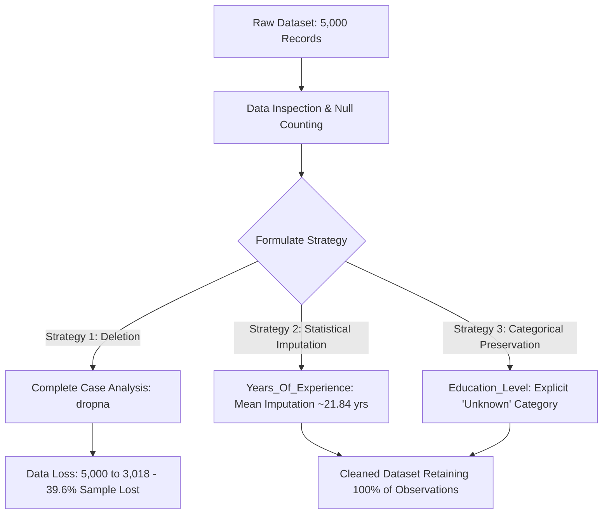

```mermaid
flowchart TD
    subgraph S1[Case Study 1: Policy Cohort Slicing]
        A1[Nigerian Economic Data: 10,000 Rows] --> B1["Condition: (Age >= 18) & (Age <= 65)"]
        B1 --> C1[Working-Age Adults: 4,923 Rows]
    end
    subgraph S2[Case Study 2: Targeted Resource Allocation]
        A2[Nursing Mothers Data: 10,000 Rows] --> B2["Condition: (Residence == 'Rural') & (Wealth_Quintile == 'Poorest')"]
        B2 --> C2[High-Priority Mothers: 1,866 Rows]
    end
    subgraph S3[Case Study 3: Anomaly & Inconsistency Auditing]
        A3[Unemployment Survey: 5,000 Rows] --> B3["Condition: (Age < 18) & (Education_Level == 'Tertiary')"]
        B3 --> C3[Flagged Suspicious Records: 52 Rows]
    end
```

# 📊 Data Science Development: Applied Data Wrangling & Analysis

[](https://www.python.org/)
[](https://pandas.pydata.org/)
[](https://jupyter.org/)
[](https://opensource.org/licenses/MIT)
[]()

A structured, end-to-end data science laboratory exploring **data hygiene**, **exploratory data analysis (EDA)**, **missing data imputation strategies**, and **advanced conditional filtering** applied across socioeconomic, public health, and labor market datasets in Nigeria.

---

## 🧭 Activity Navigation Index

| Module / Day | Topic & Core Focus | Target Dataset | Key Notebook |
| :--- | :--- | :--- | :--- |
| [**Activity 1 (Day 1)**](#-activity-1-day-1--missing-data-diagnostics--imputation-methodologies) | Ingestion, Null Counting, Listwise Deletion vs. Statistical & Categorical Imputation | `nigeria_unemployment_missing_data.csv` | [`day-1-data-wrangling.ipynb`](./day-1-data-wrangling.ipynb) |
| [**Activity 2 (Day 2)**](#-activity-2-day-2--advanced-conditional-filtering--anomaly-auditing) | Compound Filtering, Policy Cohort Slicing, Vulnerability Subsetting, Anomaly Detection | `nigeria_economic_data.csv`<br>`nigeria_nursing_mothers_healthcare.csv`<br>`nigeria_unemployment_missing_data.csv` | [`day-2-data-wrangling & filtering.ipynb`](./day-2-data-wrangling%20%26%20filtering.ipynb) |

---

## 🍽️ The Core Philosophy: *The Data Kitchen & The Data Chef*

In real-world data science, raw data rarely arrives clean, balanced, or modeling-ready. Just as a professional chef cannot cook unwashed, uninspected, or poorly measured ingredients straight from the market:

- **Raw Ingredients = Raw Data**: Datasets often contain missing entries ("spoilage/rot"), inconsistent units, demographic contradictions, and survey anomalies.
- **The Data Chef = The Data Scientist**: Responsible for inspecting every feature, assessing data hygiene, diagnosing *why* anomalies exist, and applying principled cleaning and filtering techniques before analytical modeling.

---

## 📁 Repository Structure

```text
├── day-1-data-wrangling.ipynb                # Day 1: Ingestion, null diagnostics, and imputation experiments
├── day-2-data-wrangling & filtering.ipynb    # Day 2: Compound conditional filtering & anomaly detection
├── nigeria_unemployment_missing_data.csv     # Employment survey dataset with missing entries (5,000 rows)
├── nigeria_economic_data.csv                 # Socioeconomic indicators & poverty level classification (10,000 rows)
├── nigeria_nursing_mothers_healthcare.csv    # Maternal healthcare access & immunization metrics (10,000 rows)
├── .gitignore                                # Standard git ignore rules for Python & Jupyter artifacts
└── README.md                                 # Comprehensive project documentation and activity log
```

---

## 📊 Datasets Overview

### 1. `nigeria_unemployment_missing_data.csv` (5,000 Records)
Demographic profiles, labor market engagement, and income data with realistic missingness patterns for data hygiene exercises.
- **Key Columns**: `Age`, `Gender`, `Region`, `Location` (Urban/Rural), `Education_Level`, `Employment_Status`, `Years_Of_Experience`, `Monthly_Income_NGN`.

### 2. `nigeria_economic_data.csv` (10,000 Records)
Individual socioeconomic indicators, occupation classifications, employment arrangements, and poverty status.
- **Key Columns**: `Individual_ID`, `Age`, `Gender`, `Region`, `Location`, `Education_Level`, `Occupation`, `Employment_Type`, `Monthly_Income_NGN`, `Poverty_Status`.

### 3. `nigeria_nursing_mothers_healthcare.csv` (10,000 Records)
Demographic and healthcare access dataset examining delivery facilities, immunization coverage, and travel distance.
- **Key Columns**: `Geopolitical_Zone`, `Residence`, `Wealth_Quintile`, `Education_Level`, `Skilled_Birth_Attendance`, `Facility_Delivery`, `Exclusive_Breastfeeding`, `Full_Immunization`, `Distance_to_Facility_km`.

---

## 🔬 Activity 1 (Day 1) — Missing Data Diagnostics & Imputation Methodologies

> **Notebook**: [`day-1-data-wrangling.ipynb`](./day-1-data-wrangling.ipynb)  
> **Primary Dataset**: `nigeria_unemployment_missing_data.csv` (5,000 rows × 8 columns)

### Workflow Overview



### Phase-by-Phase Breakdown

#### Phase 1: Ingestion & Initial Inspection
- Loaded `nigeria_unemployment_missing_data.csv` using `pandas.read_csv()`.
- Validated initial dimension: **5,000 observations across 8 features**.
- Inspected leading rows (`.head()`) to understand variable types and structural schema.

#### Phase 2: Missing Value Diagnostics ("Identifying the Rot")
Quantified null counts across each column using `.isnull().sum()`:
- **`Education_Level`**: 1,127 missing values (~22.54%)
- **`Years_Of_Experience`**: 500 missing values (10.00%)
- **`Monthly_Income_NGN`**: 408 missing values (8.16%)
- **`Region`**: 250 missing values (5.00%)
- **`Age`, `Gender`, `Location`, `Employment_Status`**: 0 missing values (Complete features)

#### Phase 3: Strategy Formulation
1. **Understand Missingness**: Evaluated whether missing values are Missing Completely at Random (MCAR), Missing at Random (MAR), or Missing Not at Random (MNAR).
2. **Weigh Analytical Cost**: Evaluated data loss resulting from naive row deletion vs. bias introduced by imputation.
3. **Establish Column-Specific Handlers**: Separated continuous metrics from categorical dimensions.

#### Phase 4: Cleaning & Imputation Experiments

##### Strategy 1: Complete Case Deletion (`dropna`)
- Applied `.dropna(inplace=True)` on a cloned dataframe.
- **Outcome**: Row count plummeted from **5,000 to 3,018 rows** (a **39.64% loss of data**).
- **Takeaway**: Listwise deletion severely shrinks sample power and introduces risk of systematic attrition bias.

##### Strategy 2: Statistical Imputation for Continuous Numerical Data
- Calculated the sample mean for `Years_Of_Experience`:
  $$\bar{x} \approx 21.835 \text{ years}$$
- Imputed null entries using `.fillna(average_experience)` to preserve complete observation count while maintaining central tendency.

##### Strategy 3: Explicit Categorical Preservation for `Education_Level`
- Evaluated non-null distribution (Secondary: 45.52%, Primary: 31.24%, Tertiary: 23.24%).
- Converted missing entries into an explicit `'Unknown'` class to retain records for non-education downstream models:
  - Secondary: 35.26% (1,763 rows)
  - Primary: 24.20% (1,210 rows)
  - Unknown: 22.54% (1,127 rows)
  - Tertiary: 18.00% (900 rows)

### Activity 1 Results Matrix

| Metric / Feature | Raw Data | Strategy 1: Drop Missing (`dropna`) | Strategy 2: Targeted Imputation |
| :--- | :--- | :--- | :--- |
| **Total Rows** | 5,000 | 3,018 (**-39.6% reduction**) | 5,000 (**100% sample retained**) |
| **Missing `Years_Of_Experience`** | 500 | 0 | 0 (Imputed with Mean: $\approx 21.84$) |
| **Missing `Education_Level`** | 1,127 | 0 | 0 (Preserved as `'Unknown'`) |
| **Sample Representativeness** | Full (with gaps) | Reduced / Potentially Biased | Maintained across all sub-populations |

---

## 🎯 Activity 2 (Day 2) — Advanced Conditional Filtering & Anomaly Auditing

> **Notebook**: [`day-2-data-wrangling & filtering.ipynb`](./day-2-data-wrangling%20%26%20filtering.ipynb)  
> **Core Concepts**: Boolean Masking, Compound Conditionals (`&`, `|`), Scope Slicing, Anomaly Auditing

### Workflow Overview



---

### Case Study 1: Working-Age Adult Cohort Filtering for Minimum Wage Analysis
- **Dataset**: `nigeria_economic_data.csv` (10,000 records)
- **Real-World Scenario**: The government is establishing a new national minimum wage policy and requires income statistics restricted exclusively to the legally eligible working-age adult population (ages 18 to 65), eliminating non-working minors and retirees from skewing calculations.
- **Filtering Logic**:
  ```python
  adult_only_eco_data = economic_data[(economic_data['Age'] >= 18) & (economic_data['Age'] <= 65)]
  ```
- **Quantitative Finding**:
  - Original Dataset: **10,000 records**
  - Filtered Working-Age Dataset: **4,923 records** (49.23% of total population)
  - Successfully filtered out students, child dependents, and out-of-labor-force cohorts ($0 \le \text{Age} < 18$ and $\text{Age} > 65$).

---

### Case Study 2: Targeted Healthcare Resource Allocation for Vulnerable Mothers
- **Dataset**: `nigeria_nursing_mothers_healthcare.csv` (10,000 records)
- **Real-World Scenario**: A non-profit healthcare NGO operating under strict budget constraints needs to deploy mobile medical teams and pediatric doctors directly to the most vulnerable demographics: mothers in rural communities belonging to the lowest socioeconomic quintile (`Poorest`).
- **Filtering Logic**:
  ```python
  targeted_mothers = health_data[(health_data['Residence'] == 'Rural') & (health_data['Wealth_Quintile'] == 'Poorest')]
  ```
- **Quantitative Finding**:
  - Original Dataset: **10,000 records**
  - High-Priority Vulnerability Cohort: **1,866 mothers** (18.66% of total sample)
  - Enables targeted intervention for skilled birth attendance, facility deliveries, and infant immunization outreach.

---

### Case Study 3: Cross-Feature Anomaly Auditing (Suspicious Data Detection)
- **Dataset**: `nigeria_unemployment_missing_data.csv` (5,000 records)
- **Real-World Scenario**: Data hygiene audit to uncover logical contradictions or potential survey entry errors before training predictive econometric models. Specifically investigating impossible or highly anomalous demographic combinations: respondents under 18 claiming to hold university/tertiary degrees.
- **Filtering Logic**:
  ```python
  suspicious_data = unemployment_data[(unemployment_data['Age'] < 18) & (unemployment_data['Education_Level'] == 'Tertiary')]
  ```
- **Quantitative Finding**:
  - Flagged **52 anomalous records** for manual verification or exclusion.
  - Highlights the necessity of multi-feature cross-validation during the preliminary wrangling phase.

---

### Activity 2 Results Matrix

| Case Study | Dataset Used | Applied Filter Condition | Initial Size | Filtered Size | Analytical Impact |
| :--- | :--- | :--- | :--- | :--- | :--- |
| **1. Minimum Wage Policy** | `nigeria_economic_data.csv` | `(Age >= 18) & (Age <= 65)` | 10,000 | **4,923** | Isolates active labor force; removes minor/retiree distortion |
| **2. Maternal Healthcare NGO** | `nigeria_nursing_mothers_healthcare.csv` | `(Residence == 'Rural') & (Wealth_Quintile == 'Poorest')` | 10,000 | **1,866** | Directs medical personnel to high-vulnerability rural mothers |
| **3. Survey Integrity Audit** | `nigeria_unemployment_missing_data.csv` | `(Age < 18) & (Education_Level == 'Tertiary')` | 5,000 | **52** | Flags data inconsistencies for review before modeling |

---

## 🚀 Getting Started & Execution

### Prerequisites
- Python 3.8+
- Jupyter Notebook / JupyterLab or VS Code Jupyter Extension
- Required packages: `pandas`, `numpy`

### Installation & Environment Setup
```bash
# 1. Clone the repository
git clone https://github.com/D-James001/Data-Science-Development.git
cd "Data Science Development"

# 2. Create and activate a virtual environment
python -m venv venv

# On Windows:
.\venv\Scripts\activate
# On Linux/macOS:
source venv/bin/activate

# 3. Install dependencies
pip install pandas numpy jupyter
```

### Running the Notebooks
To explore each activity independently:

```bash
# Run Day 1: Missing Data Diagnostics & Imputation
jupyter notebook day-1-data-wrangling.ipynb

# Run Day 2: Advanced Conditional Filtering & Anomaly Detection
jupyter notebook "day-2-data-wrangling & filtering.ipynb"
```

---

## 🔮 Roadmap & Upcoming Activities

- [x] **Day 1**: Missing Data Diagnostics, Complete Case Deletion vs. Statistical & Categorical Imputation.
- [x] **Day 2**: Compound Boolean Filtering, Policy Slicing, Vulnerability Subsetting, and Anomaly Auditing.
- [ ] **Day 3**: Outlier Detection & Treatment (Interquartile Range - IQR, Z-Scores, Winsorization).
- [ ] **Day 4**: Feature Transformation, Numerical Scaling & Categorical Encoding (One-Hot, Ordinal).
- [ ] **Day 5**: Exploratory Data Analysis (EDA) & Multivariate Visualizations.
- [ ] **Day 6**: Predictive Modeling on Maternal Health & Economic Determinants.

---

## 📄 License
This project is open source and available under the [MIT License](LICENSE).
