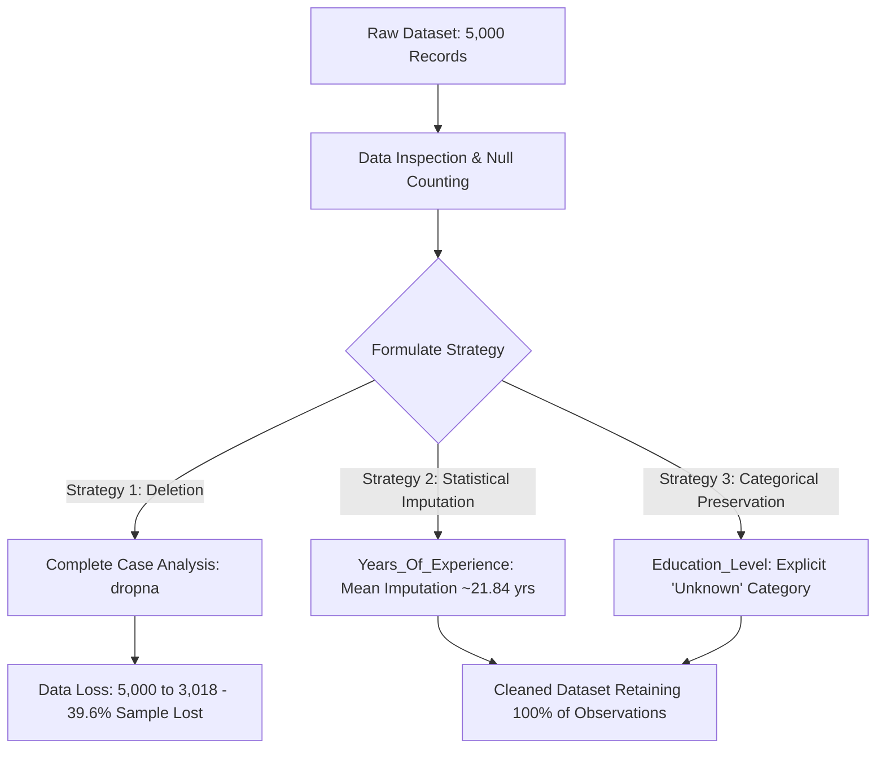
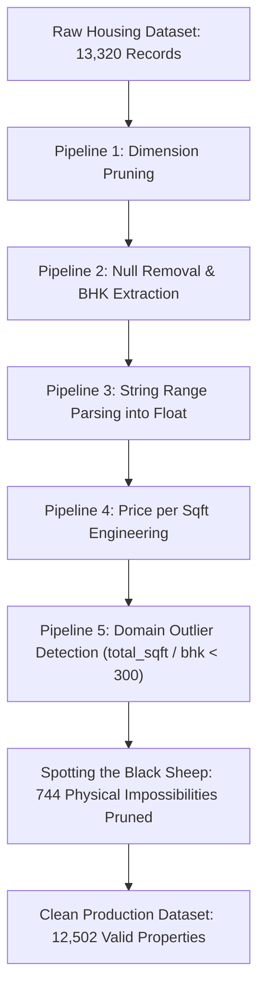
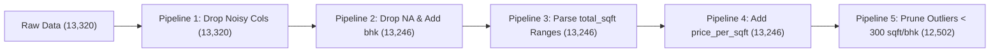

```mermaid
flowchart TD
    subgraph S1[Case Study 1: Policy Cohort Slicing]
        A1[Nigerian Economic Data: 10,000 Rows] --> B1["Condition: (Age >= 18) & (Age <= 65)"]
        B1 --> C1[Working-Age Adults: 4,923 Rows]
    end
    subgraph S2[Case Study 2: Targeted Resource Allocation]
        A2[Nursing Mothers Data: 10,000 Rows] --> B2["Condition: (Residence == 'Rural') & (Wealth_Quintile == 'Poorest')"]
        B2 --> C2[High-Priority Mothers: 1,866 Rows]
    end
    subgraph S3[Case Study 3: Anomaly & Inconsistency Auditing]
        A3[Unemployment Survey: 5,000 Rows] --> B3["Condition: (Age < 18) & (Education_Level == 'Tertiary')"]
        B3 --> C3[Flagged Suspicious Records: 52 Rows]
    end
```

```mermaid
flowchart TD
    subgraph A1[Scenario 1: Economic Returns to Education]
        D1[Nigerian Economic Data] --> G1["groupby('Education_Level')['Monthly_Income_NGN'].mean()"]
        G1 --> R1["Tertiary: ₦348.6k | Secondary: ₦122.2k | Primary: ₦38.7k"]
    end
    subgraph A2[Scenario 2: Healthcare Geographic Sizing]
        D2[Nursing Mothers Data] --> F2["Filter: Wealth == 'Poorest'"]
        F2 --> G2["groupby('Geopolitical_Zone').size()"]
        G2 --> R2["North West Lead: 601 Mothers (26.6%)"]
    end
    subgraph A3[Scenario 3 & 4: Labor Market Dynamics & Gender Parity]
        D3[Unemployment Survey] --> G3["groupby(['Employment_Status', 'Gender'])['Years_Of_Experience'].mean()"]
        G3 --> R3["Gender Parity Confirmed across all Employment Tiers"]
    end
    subgraph A4[Scenario 5: Multi-Metric Report Card]
        D4[Economic Dataset] --> G4["groupby('Education_Level')['Monthly_Income_NGN'].agg(['min', 'max', 'mean', 'count'])"]
        G4 --> R4["Full Statistical Distribution & Wage Ceilings"]
    end
```

# 📊 Data Science Development: Applied Data Wrangling & Analysis Portfolio

[](https://www.python.org/)
[](https://pandas.pydata.org/)
[](https://jupyter.org/)
[](https://opensource.org/licenses/MIT)
[]()

An applied, portfolio-grade data science repository demonstrating **data hygiene**, **missing value diagnostics & imputation architecture**, **advanced conditional filtering & anomaly detection**, **multi-dimensional statistical aggregation**, and **domain-driven outlier engineering** across socioeconomic, public health, labor market, and real estate datasets.

---

## 🧭 Activity Navigation Index

| Module / Day | Topic & Core Focus | Applied Methodologies | Target Datasets | Notebook Link |
| :--- | :--- | :--- | :--- | :--- |
| [**Activity 1 (Day 1)**](#-activity-1-day-1--missing-data-diagnostics--imputation-methodologies) | **Data Hygiene & Imputation** | Ingestion, Null Diagnostics, Listwise Deletion vs. Mean & Explicit Categorical Imputation | `nigeria_unemployment_missing_data.csv` | [`day-1-data-wrangling.ipynb`](./day-1-data-wrangling.ipynb) |
| [**Activity 2 (Day 2)**](#-activity-2-day-2--advanced-conditional-filtering--anomaly-auditing) | **Conditional Slicing & Auditing** | Compound Boolean Indexing (`&`, `\|`), Policy Slicing, Resource Allocation, Cross-Feature Auditing | `nigeria_economic_data.csv`<br>`nigeria_nursing_mothers_healthcare.csv`<br>`nigeria_unemployment_missing_data.csv` | [`day-2-data-wrangling & filtering.ipynb`](./day-2-data-wrangling%20%26%20filtering.ipynb) |
| [**Activity 3 (Day 3)**](#-activity-3-day-3--data-aggregation-multi-dimensional-grouping--statistical-reporting) | **Aggregation & Statistical Reporting** | `.groupby()`, Multi-Level Grouping, Aggregation Engines (`.agg()`), Frequency Binning | `nigeria_economic_data.csv`<br>`nigeria_nursing_mothers_healthcare.csv`<br>`nigeria_unemployment_missing_data.csv` | [`day-3-data-aggregation.ipynb`](./day-3-data-aggregation.ipynb) |
| [**Activity 4 (Day 4)**](#-activity-4-day-4--deep-dive-missing-data-architecture-sentinel-evolution--advanced-imputation) | **Missing Data Architecture & Advanced Imputation** | Sentinel Evolution, Nullable `Int32`, Geography Pruning, Skewness & Median Imputation, Subgroup Fill | `nigeria_unemployment_missing_data.csv` | [`day-4-data-wrangling-and-missing-data.ipynb`](./day-4-data-wrangling-and-missing-data.ipynb) |
| [**Activity 5 (Day 5)**](#-activity-5-day-5--exploratory-data-analysis-for-outlier-detection-spatial-engineering--domain-driven-filtration) | **Outlier Detection & Domain-Driven Filtration** | Multi-Stage Pipelines (1–5), Continuous Range Parsing, Feature Engineering (`bhk`, `price_per_sqft`), Domain Thresholding | `house_prices.csv` | [`day-5-outlier-outlier-detection.ipynb`](./day-5-outlier-outlier-detection.ipynb) |

---

## 🍽️ The Core Philosophy: *The Data Kitchen & The Data Chef*

In real-world data science, raw data rarely arrives clean, balanced, or modeling-ready. Just as a professional chef cannot cook unwashed, uninspected, or poorly measured ingredients straight from the market:

- **Raw Ingredients = Raw Data**: Datasets contain missing entries ("spoilage/rot"), inconsistent units, demographic contradictions, formatting range strings, and physical anomalies.
- **The Data Chef = The Data Scientist**: Responsible for inspecting every feature, assessing data hygiene, diagnosing *why* anomalies exist, applying principled cleaning, slicing cohorts, engineering aggregations, and isolating outliers before machine learning modeling.

---

## 📁 Repository Structure

```text
├── day-1-data-wrangling.ipynb                    # Day 1: Ingestion, null diagnostics, and imputation experiments
├── day-2-data-wrangling & filtering.ipynb        # Day 2: Compound conditional filtering & anomaly detection
├── day-3-data-aggregation.ipynb                  # Day 3: Multi-dimensional grouping, aggregation & reporting
├── day-4-data-wrangling-and-missing-data.ipynb   # Day 4: Missing data architecture, sentinel theory & advanced imputation
├── day-5-outlier-outlier-detection.ipynb         # Day 5: Multi-stage pipeline architecture & domain outlier filtration
├── nigeria_unemployment_missing_data.csv         # Employment survey dataset with missing entries (5,000 rows)
├── nigeria_economic_data.csv                     # Socioeconomic indicators & poverty level classification (10,000 rows)
├── nigeria_nursing_mothers_healthcare.csv        # Maternal healthcare access & immunization metrics (10,000 rows)
├── .gitignore                                    # Standard git ignore rules for Python & Jupyter artifacts
└── README.md                                     # Comprehensive project documentation and portfolio log
```

---

## 📊 Datasets Overview

### 1. `nigeria_unemployment_missing_data.csv` (5,000 Records)
Demographic profiles, labor market engagement, and income data with realistic missingness patterns for data hygiene and labor dynamics exercises.
- **Key Columns**: `Age`, `Gender`, `Region`, `Location` (Urban/Rural), `Education_Level`, `Employment_Status`, `Years_Of_Experience`, `Monthly_Income_NGN`.

### 2. `nigeria_economic_data.csv` (10,000 Records)
Individual socioeconomic indicators, occupation classifications, employment arrangements, monthly income, and poverty status classification.
- **Key Columns**: `Individual_ID`, `Age`, `Gender`, `Region`, `Location`, `Education_Level`, `Occupation`, `Employment_Type`, `Monthly_Income_NGN`, `Poverty_Status`.

### 3. `nigeria_nursing_mothers_healthcare.csv` (10,000 Records)
Demographic and healthcare access dataset examining delivery facilities, immunization coverage, wealth quintiles, and travel distance to clinics.
- **Key Columns**: `Geopolitical_Zone`, `Residence`, `Wealth_Quintile`, `Education_Level`, `Skilled_Birth_Attendance`, `Facility_Delivery`, `Exclusive_Breastfeeding`, `Full_Immunization`, `Distance_to_Facility_km`.

### 4. `house_prices.csv` (13,320 Records)
Real estate and residential property transaction dataset with mixed string formats, range-based square footage, bathroom configurations, and pricing distributions.
- **Key Columns**: `area_type`, `availability`, `location`, `size` (e.g. `'2 BHK'`, `'4 Bedroom'`), `society`, `total_sqft` (e.g. `'1056'`, `'2100 - 2850'`), `bath`, `balcony`, `price`.

---

## 🔬 Activity 1 (Day 1) — Missing Data Diagnostics & Imputation Methodologies

> **Notebook**: [`day-1-data-wrangling.ipynb`](./day-1-data-wrangling.ipynb)  
> **Primary Dataset**: `nigeria_unemployment_missing_data.csv` (5,000 rows × 8 columns)

### Workflow Overview



### Phase-by-Phase Breakdown

#### Phase 1: Ingestion & Initial Inspection
- Loaded `nigeria_unemployment_missing_data.csv` using `pandas.read_csv()`.
- Validated initial dimension: **5,000 observations across 8 features**.
- Inspected leading rows (`.head()`) to understand variable types and structural schema.

#### Phase 2: Missing Value Diagnostics ("Identifying the Rot")
Quantified null counts across each column using `.isnull().sum()`:
- **`Education_Level`**: 1,127 missing values (~22.54%)
- **`Years_Of_Experience`**: 500 missing values (10.00%)
- **`Monthly_Income_NGN`**: 408 missing values (8.16%)
- **`Region`**: 250 missing values (5.00%)
- **`Age`, `Gender`, `Location`, `Employment_Status`**: 0 missing values (Complete features)

#### Phase 3: Strategy Formulation
1. **Understand Missingness**: Evaluated whether missing values are Missing Completely at Random (MCAR), Missing at Random (MAR), or Missing Not at Random (MNAR).
2. **Weigh Analytical Cost**: Evaluated data loss resulting from naive row deletion vs. bias introduced by imputation.
3. **Establish Column-Specific Handlers**: Separated continuous metrics from categorical dimensions.

#### Phase 4: Cleaning & Imputation Experiments

##### Strategy 1: Complete Case Deletion (`dropna`)
- Applied `.dropna(inplace=True)` on a cloned dataframe.
- **Outcome**: Row count plummeted from **5,000 to 3,018 rows** (a **39.64% loss of data**).
- **Takeaway**: Listwise deletion severely shrinks sample power and introduces risk of systematic attrition bias.

##### Strategy 2: Statistical Imputation for Continuous Numerical Data
- Calculated the sample mean for `Years_Of_Experience`:
  $$\bar{x} \approx 21.835 \text{ years}$$
- Imputed null entries using `.fillna(average_experience)` to preserve complete observation count while maintaining central tendency.

##### Strategy 3: Explicit Categorical Preservation for `Education_Level`
- Evaluated non-null distribution (Secondary: 45.52%, Primary: 31.24%, Tertiary: 23.24%).
- Converted missing entries into an explicit `'Unknown'` class to retain records for non-education downstream models:
  - Secondary: 35.26% (1,763 rows)
  - Primary: 24.20% (1,210 rows)
  - Unknown: 22.54% (1,127 rows)
  - Tertiary: 18.00% (900 rows)

### Activity 1 Results Matrix

| Metric / Feature | Raw Data | Strategy 1: Drop Missing (`dropna`) | Strategy 2: Targeted Imputation |
| :--- | :--- | :--- | :--- |
| **Total Rows** | 5,000 | 3,018 (**-39.6% reduction**) | 5,000 (**100% sample retained**) |
| **Missing `Years_Of_Experience`** | 500 | 0 | 0 (Imputed with Mean: $\approx 21.84$) |
| **Missing `Education_Level`** | 1,127 | 0 | 0 (Preserved as `'Unknown'`) |
| **Sample Representativeness** | Full (with gaps) | Reduced / Potentially Biased | Maintained across all sub-populations |

---

## 🎯 Activity 2 (Day 2) — Advanced Conditional Filtering & Anomaly Auditing

> **Notebook**: [`day-2-data-wrangling & filtering.ipynb`](./day-2-data-wrangling%20%26%20filtering.ipynb)  
> **Core Concepts**: Boolean Masking, Compound Conditionals (`&`, `|`), Scope Slicing, Anomaly Auditing

### Workflow Overview



---

### Case Study 1: Working-Age Adult Cohort Filtering for Minimum Wage Analysis
- **Dataset**: `nigeria_economic_data.csv` (10,000 records)
- **Real-World Scenario**: The government is establishing a new national minimum wage policy and requires income statistics restricted exclusively to the legally eligible working-age adult population (ages 18 to 65), eliminating non-working minors and retirees from skewing calculations.
- **Filtering Logic**:
  ```python
  adult_only_eco_data = economic_data[(economic_data['Age'] >= 18) & (economic_data['Age'] <= 65)]
  ```
- **Quantitative Finding**:
  - Original Dataset: **10,000 records**
  - Filtered Working-Age Dataset: **4,923 records** (49.23% of total population)
  - Successfully filtered out students, child dependents, and out-of-labor-force cohorts ($0 \le \text{Age} < 18$ and $\text{Age} > 65$).

---

### Case Study 2: Targeted Healthcare Resource Allocation for Vulnerable Mothers
- **Dataset**: `nigeria_nursing_mothers_healthcare.csv` (10,000 records)
- **Real-World Scenario**: A non-profit healthcare NGO operating under strict budget constraints needs to deploy mobile medical teams and pediatric doctors directly to the most vulnerable demographics: mothers in rural communities belonging to the lowest socioeconomic quintile (`Poorest`).
- **Filtering Logic**:
  ```python
  targeted_mothers = health_data[(health_data['Residence'] == 'Rural') & (health_data['Wealth_Quintile'] == 'Poorest')]
  ```
- **Quantitative Finding**:
  - Original Dataset: **10,000 records**
  - High-Priority Vulnerability Cohort: **1,866 mothers** (18.66% of total sample)
  - Enables targeted intervention for skilled birth attendance, facility deliveries, and infant immunization outreach.

---

### Case Study 3: Cross-Feature Anomaly Auditing (Suspicious Data Detection)
- **Dataset**: `nigeria_unemployment_missing_data.csv` (5,000 records)
- **Real-World Scenario**: Data hygiene audit to uncover logical contradictions or potential survey entry errors before training predictive econometric models. Specifically investigating impossible or highly anomalous demographic combinations: respondents under 18 claiming to hold university/tertiary degrees.
- **Filtering Logic**:
  ```python
  suspicious_data = unemployment_data[(unemployment_data['Age'] < 18) & (unemployment_data['Education_Level'] == 'Tertiary')]
  ```
- **Quantitative Finding**:
  - Flagged **52 anomalous records** for manual verification or exclusion.
  - Highlights the necessity of multi-feature cross-validation during the preliminary wrangling phase.

---

### Activity 2 Results Matrix

| Case Study | Dataset Used | Applied Filter Condition | Initial Size | Filtered Size | Analytical Impact |
| :--- | :--- | :--- | :--- | :--- | :--- |
| **1. Minimum Wage Policy** | `nigeria_economic_data.csv` | `(Age >= 18) & (Age <= 65)` | 10,000 | **4,923** | Isolates active labor force; removes minor/retiree distortion |
| **2. Maternal Healthcare NGO** | `nigeria_nursing_mothers_healthcare.csv` | `(Residence == 'Rural') & (Wealth_Quintile == 'Poorest')` | 10,000 | **1,866** | Directs medical personnel to high-vulnerability rural mothers |
| **3. Survey Integrity Audit** | `nigeria_unemployment_missing_data.csv` | `(Age < 18) & (Education_Level == 'Tertiary')` | 5,000 | **52** | Flags data inconsistencies for review before modeling |

---

## 📈 Activity 3 (Day 3) — Data Aggregation, Multi-Dimensional Grouping & Statistical Reporting

> **Notebook**: [`day-3-data-aggregation.ipynb`](./day-3-data-aggregation.ipynb)  
> **Core Concepts**: `.groupby()`, Multi-Level Grouping ("Buckets within Buckets"), Multi-Metric `.agg()`, Frequency Sizing, Strategic Reporting

### Workflow Overview



---

### Scenario 1: Economic Returns to Higher Education ("Does Education Pay Off?")
- **Dataset**: `nigeria_economic_data.csv` (10,000 records)
- **Analytical Objective**: Determine whether higher educational attainment translates to statistically significant income premiums in the Nigerian economy.
- **Code Implementation**:
  ```python
  economy_data.groupby('Education_Level')['Monthly_Income_NGN'].mean().round(2)
  ```
- **Quantitative Findings**:
  - **Primary Education**: **₦38,722.55 / month**
  - **Secondary Education**: **₦122,211.60 / month** (3.15x higher than Primary)
  - **Tertiary Education**: **₦348,555.70 / month** (9.00x higher than Primary, 2.85x higher than Secondary)
  - **Takeaway**: Demonstrates steep exponential income scaling linked to higher education completion.

---

### Scenario 2: Resource Allocation & Geographic Prioritization for Nursing Mothers
- **Dataset**: `nigeria_nursing_mothers_healthcare.csv` (10,000 records)
- **Analytical Objective**: Identify the Nigerian geopolitical zone with the greatest concentration of vulnerable mothers in the lowest economic quintile (`Poorest`) to optimize NGO medical supply chains.
- **Code Implementation**:
  ```python
  poorest_mothers = nursing_data[nursing_data['Wealth_Quintile'] == 'Poorest']
  mothers_count_region = poorest_mothers.groupby('Geopolitical_Zone').size()
  ```
- **Quantitative Findings**:
  - **North West**: **601 poorest mothers** (26.56% of total vulnerable cohort — highest priority)
  - **South East**: **374 poorest mothers**
  - **South West**: **363 poorest mothers**
  - **North Central**: **332 poorest mothers**
  - **North East**: **328 poorest mothers**
  - **South South**: **324 poorest mothers**
  - **Takeaway**: Directly informs non-profit resource allocation, establishing that medical outreach logistics must center on the North West zone.

---

### Scenario 3: Labor Market Experience Dynamics across Employment States
- **Dataset**: `nigeria_unemployment_missing_data.csv` (5,000 records)
- **Analytical Objective**: Investigate the relationship between professional experience and employment states (Employed, Underemployed, Unemployed).
- **Code Implementation**:
  ```python
  exp_status = unemployment_data.groupby('Employment_Status')['Years_Of_Experience'].mean().round(2)
  ```
- **Quantitative Findings**:
  - **Employed**: **21.72 years** average experience
  - **Underemployed**: **22.38 years** average experience
  - **Unemployed**: **20.83 years** average experience
  - **Takeaway**: Rebuts the assumption that underemployment and unemployment stem purely from lack of experience. Underemployed individuals possess slightly higher average career longevity.

---

### Scenario 4: Hierarchical Multi-Level Grouping ("Buckets within Buckets" / Gender Equity)
- **Dataset**: `nigeria_unemployment_missing_data.csv` (5,000 records)
- **Analytical Objective**: Disaggregate employment tiers by gender to evaluate if experience distributions differ between men and women in the labor force.
- **Code Implementation**:
  ```python
  exp_status_gender = unemployment_data.groupby(['Employment_Status', 'Gender'])['Years_Of_Experience'].mean().round(2)
  ```
- **Quantitative Findings**:
  - **Employed**: Female (21.47 yrs) vs. Male (21.96 yrs)
  - **Underemployed**: Female (22.39 yrs) vs. Male (22.37 yrs)
  - **Unemployed**: Female (20.96 yrs) vs. Male (20.70 yrs)
  - **Takeaway**: Validates consistent experience parity across genders within each employment tier.

---

### Scenario 5: Multi-Metric Statistical Profiling ("The Full Report Card")
- **Dataset**: `nigeria_economic_data.csv` (10,000 records)
- **Analytical Objective**: Move beyond single-metric averages to generate a multi-dimensional statistical profile capturing min, max, mean, and sample size across education tiers.
- **Code Implementation**:
  ```python
  full_income_report = economy_data.groupby('Education_Level')['Monthly_Income_NGN'].agg(['min', 'max', 'mean', 'count']).round(2)
  ```

#### The Full Income Report Card Matrix

| Education Level | Sample Size (`count`) | Minimum Income (`min`) | Maximum Income (`max`) | Mean Income (`mean`) | Economic Insight |
| :--- | :--- | :--- | :--- | :--- | :--- |
| **Primary** | 2,953 | ₦0.00 | ₦764,691.33 | **₦38,722.55** | High baseline density; lowest earnings floor |
| **Secondary** | 2,283 | ₦0.00 | ₦838,454.45 | **₦122,211.60** | 3.15x average income lift over Primary |
| **Tertiary** | 768 | ₦0.00 | ₦2,341,233.81 | **₦348,555.70** | Earnings ceiling exceeds ₦2.34M (2.8x higher max) |

---

## 🛠️ Activity 4 (Day 4) — Deep-Dive Missing Data Architecture, Sentinel Evolution & Advanced Imputation

> **Notebook**: [`day-4-data-wrangling-and-missing-data.ipynb`](./day-4-data-wrangling-and-missing-data.ipynb)  
> **Core Concepts**: Masking vs. Sentinel Representation, IEEE 754 `NaN` Floating-Point Coercion, The NaN "Virus Effect", Modern Nullable `Int32`/`boolean` (`pd.NA`), Geography Pruning, Skewness-Driven Imputation (Mean vs. Median), Group-Based Conditional Imputation

### Workflow Overview

```mermaid
flowchart TD
    A[Raw Unemployment Dataset: 5,000 Records] --> B[Full Column Missingness Audit]
    B --> C{Strategic Treatment by Feature Type}
    C -->|1. Non-Imputable Geography| D["Pruning: dropna(subset=['Region', 'Location'])"]
    D --> E[Clean Spatial Baseline: 4,750 Rows - 250 Pruned]
    C -->|2. Categorical Variable| F["Class Preservation: fillna('Unspecified')"]
    F --> G[Education_Level Retained with Full Variance]
    C -->|3. Skewed Continuous Variable| H[Distribution Check: Mean ₦58.1k vs. Median ₦42.9k]
    H --> I[Median Imputation Selected to Resist Outlier Distortion]
    C -->|4. Group-Dependent Metric| J["Subgroup Mean Fill: groupby('Employment_Status')['Experience']"]
    J --> K[Employed: 21.72 yrs | Underemployed: 22.38 yrs | Unemployed: 20.83 yrs]
    E --> L[Production-Ready Imputed Dataset]
    G --> L
    I --> L
    K --> L
```

---

### Theoretical Architecture: The Evolution of Missingness in Python & Pandas

#### 1. Masking vs. Sentinel Placeholders
- **The Masking Approach**: Allocating an auxiliary boolean array alongside the dataset to flag valid vs. missing cells (high memory footprint, robust type preservation).
- **The Sentinel Approach**: Inserting a reserved placeholder directly inside data structures (e.g., `-9999`, `None`, `np.nan`).

#### 2. The Floating-Point Coercion & "Virus Effect" of `NaN`
In standard NumPy and legacy Pandas, `np.nan` is an IEEE 754 floating-point value. This introduced two major engineering challenges:
1. **Type Coercion**: Adding a single missing value to an integer column automatically upcasted the entire column from `int64` to `float64`.
2. **The "Virus Effect"**: Any standard mathematical operation involving `np.nan` evaluates strictly to `nan`:
   $$\sum (1, \text{nan}, 3, 4) \rightarrow \text{nan} \quad \text{versus} \quad \text{np.nansum}() \rightarrow 8.0$$

#### 3. Modern Pandas Nullable Data Types (`pd.NA`)
Pandas introduced first-class nullable types (`Int32`, `Int64`, `boolean`, `string`) utilizing a dedicated missingness scalar (`<NA>` / `pd.NA`), enabling true integer and boolean storage without float coercion:
```python
nullable_series = pd.Series([1, np.nan, 2, None, pd.NA], dtype='Int32')
# Output: [1, <NA>, 2, <NA>, <NA>], dtype: Int32
```

---

### Mental Models & Root Cause Taxonomy in Machine Learning

| Missingness Mechanism | Root Cause & Context | Analytical Risk | Prescribed Strategy |
| :--- | :--- | :--- | :--- |
| **Missing by Accident (MCAR)** | Random sensor failure, transmission packet loss | Minimal systematic bias; sample size reduction | Statistical imputation (Mean/Median/KNN) |
| **Missing by Logic / Nature (MAR)** | Survey questions that conditionally do not apply to respondent | Systematic bias if dropped | Conditional subgroup imputation or structural zeroing |
| **Missing on Purpose (MNAR)** | Sensitive disclosures (income, wealth, evasiveness) | Heavy truncation bias | Explicit class preservation (`'Unspecified'`) |

---

### Step-by-Step Hands-On Imputation Framework

#### Step 1: Column-by-Column Missingness Audit
- Total initial rows: **5,000**
- Missing counts: `Education_Level` (1,127), `Years_Of_Experience` (500), `Monthly_Income_NGN` (408), `Region` (250).

#### Step 2: Critical Feature Pruning (Row Dropping)
- **Action**: Pruned observations where location coordinates were missing (`dropna(subset=['Region', 'Location'])`).
- **Outcome**: Preserved **4,750 high-integrity observations** (exactly 250 incomplete rows pruned) to prevent geospatial hallucinations.

#### Step 3: Distribution Skewness & Central Tendency Evaluation
- **Analysis**: Calculated central tendency metrics for `Monthly_Income_NGN`:
  - **Median Income**: **₦42,908.88**
  - **Mean Income**: **₦58,114.54** (35.4% higher than median)
- **Visual Diagnostics**: Fitted a histogram with Kernel Density Estimation (KDE), revealing severe right-skewness driven by high-earning outliers.
- **Methodological Choice**: Median imputation is strictly preferred over mean imputation for right-skewed variables to prevent artificial upward inflation of income baselines.

#### Step 4: Explicit Categorical Class Preservation
- Preserved missing `Education_Level` records by mapping them to `'Unspecified'` (`.fillna('Unspecified')`).

#### Step 5: Group-Based Conditional Imputation
- Applied conditional subgroup averages based on `Employment_Status`:
  - **Employed**: **21.72 years**
  - **Underemployed**: **22.38 years**
  - **Unemployed**: **20.83 years**

---

### Activity 4 Results Matrix

| Pipeline Stage | Applied Technique | Target Variable | Dataset Size Before $\rightarrow$ After | Methodological Justification |
| :--- | :--- | :--- | :--- | :--- |
| **1. Geography Pruning** | `dropna(subset=['Region', 'Location'])` | `Region`, `Location` | 5,000 $\rightarrow$ **4,750** rows | Eliminates geospatial fabrication |
| **2. Skewness Assessment** | Median Imputation (₦42.9k) | `Monthly_Income_NGN` | 408 missing $\rightarrow$ **0 missing** | Resists right-skewed outlier inflation |
| **3. Categorical Patch** | `.fillna('Unspecified')` | `Education_Level` | 1,127 missing $\rightarrow$ **0 missing** | Prevents synthetic educational histories |
| **4. Group Imputation** | `.groupby('Employment_Status').mean()` | `Years_Of_Experience` | 500 missing $\rightarrow$ **0 missing** | Preserves intra-cohort career variance |

---

## 🔍 Activity 5 (Day 5) — Exploratory Data Analysis for Outlier Detection, Spatial Engineering & Domain-Driven Filtration

> **Notebook**: [`day-5-outlier-outlier-detection.ipynb`](./day-5-outlier-outlier-detection.ipynb)  
> **Core Concepts**: Multi-Stage DataFrame Pipelines (1–5), Continuous Range Parsing, Feature Engineering (`bhk`, `price_per_sqft`), Domain-Driven Architectural Thresholding, Outlier Pruning

### Workflow Overview



---

### Theoretical Foundation: Spotting the "Black Sheep" (Good vs. Bad Outliers)
In exploratory data analysis and predictive modeling, outliers represent observations that deviate substantially from the central data distribution:
- **Bad Outliers (Errors & Impossibilities)**: Typos, misplaced decimals, contradictory units (e.g., an 8-bedroom house fitting into 600 total square feet = 75 sqft/room). If left untreated, linear models and neural networks will fit spurious gradients to these physical anomalies.
- **Good Outliers (Genuine Rare Events)**: Legitimate luxury estates (e.g., a 10,000 sqft mansion priced at ₦500M). These should be retained or capped rather than indiscriminately discarded.

---

### The 5-Stage DataFrame Pipeline Architecture



#### Pipeline 1 (`housing_data_one`): Feature Selection & Dimension Pruning
- **Action**: Evaluated property pricing relevance with real estate domain experts and pruned 4 non-predictive/noisy attributes (`area_type`, `availability`, `society`, `balcony`).
- **Retained Features**: `location`, `size`, `total_sqft`, `bath`, `price`.

#### Pipeline 2 (`housing_data_two`): Null Removal & Room Feature Engineering (`bhk`)
- **Missing Value Handling**: Dropped sparse rows containing null values (`location`: 1, `size`: 16, `bath`: 73), yielding **13,246 clean rows**.
- **Feature Extraction**: Extracted integer bedroom count (`bhk`) from heterogeneous string categories (`'2 BHK'`, `'4 Bedroom'`, `'1 RK'`):
  ```python
  housing_data_two['bhk'] = housing_data_two['size'].apply(lambda x: int(x.split(' ')[0]))
  ```

#### Pipeline 3 (`housing_data_three`): Continuous Range Parsing into Floats
- **Challenge**: The `total_sqft` column contained mixed string representations including dashed ranges (`'2100 - 2850'`), metric units (`'34.46Sq. Meter'`), and acreage (`'5.31Acres'`).
- **Parsing Engine**: Built a conversion function averaging range intervals and casting plain numerical strings to `float64`:
  ```python
  def convert_sqft_to_num(x):
      tokens = x.split('-')
      if len(tokens) == 2:
          return (float(tokens[0]) + float(tokens[1])) / 2
      try:
          return float(x)
      except:
          return None

  housing_data_three['total_sqft'] = housing_data_three['total_sqft'].apply(convert_sqft_to_num)
  ```

#### Pipeline 4 (`housing_data_four`): Standardized Unit Pricing (`price_per_sqft`)
- **Metric Engineering**: Calculated standardized price per square foot across all locations to evaluate pricing consistency:
  ```python
  housing_data_four['price_per_sqft(100)'] = housing_data_four['price'] * 100 / housing_data_four['total_sqft']
  ```

#### Pipeline 5 (`housing_data_five`): Domain-Driven Architectural Outlier Filtration
- **Domain Knowledge Rule**: In standard civil engineering and architecture, a standard bedroom requires a baseline minimum of **$\approx 300\text{ sqft}$** of total built area (including hallway, bathroom, and kitchen distribution).
- **Anomaly Detection Logic**: Flagged and removed properties violating this physical threshold:
  ```python
  # Filter out properties where average square footage per bedroom is under 300 sqft
  housing_data_five = housing_data_five[~(housing_data_five['total_sqft'] / housing_data_five['bhk'] < 300)]
  ```
- **Quantitative Result**:
  - Properties before filtration: **13,246**
  - Impossible anomalous properties identified: **744 records** (e.g., 6 bedrooms in 1,020 sqft, 8 bedrooms in 600 sqft)
  - Final Clean Production Dataset: **12,502 high-integrity records**

---

### Activity 5 Results Matrix

| Pipeline Stage | Operation / Transformation | Feature Affected | Observations | Analytical Rationale |
| :--- | :--- | :--- | :--- | :--- |
| **Pipeline 1** | Feature Pruning | `area_type`, `society`, etc. | 13,320 rows | Eliminates high-sparsity & noisy features |
| **Pipeline 2** | `bhk` Feature Engineering | `size` $\rightarrow$ `bhk` (int) | 13,246 rows | Extracts numerical room capacity |
| **Pipeline 3** | String Range Conversion | `total_sqft` (float) | 13,246 rows | Averages range intervals (e.g., 2100–2850 $\rightarrow$ 2475) |
| **Pipeline 4** | Unit Metric Engineering | `price_per_sqft` | 13,246 rows | Normalizes price across property sizes |
| **Pipeline 5** | Domain Outlier Pruning | $\frac{\text{total\_sqft}}{\text{bhk}} \ge 300$ | **12,502 rows** | **Removes 744 physical/architectural anomalies** |

---

## 🧩 End-to-End Pipeline Synthesis (Days 1–5)

| Stage | Activity | Key Challenge Solved | Primary Tool / Technique | Core Analytical Deliverable |
| :--- | :--- | :--- | :--- | :--- |
| **Phase 1** | **Baseline Hygiene & Diagnostics** | Initial missingness quantification & listwise deletion cost | `.isnull().sum()`, `.dropna()` | Quantified 39.6% row loss risk in complete case deletion |
| **Phase 2** | **Conditional Slicing & Auditing** | Isolating demographic cohorts & detecting contradictions | Compound boolean masking (`&`, `\|`) | Sliced 4,923 working-age adults; 1,866 priority mothers; 52 audit flags |
| **Phase 3** | **Aggregation & Reporting** | Condensing granular rows into macro policy insights | `.groupby()`, `.agg()`, hierarchical grouping | Multi-metric ROI report cards & geographic allocation plan |
| **Phase 4** | **Architectural Imputation** | Handling skewness, sentinel evolution & subgroup variance | Nullable `Int32`, median patching, group-based fill | Production-grade clean dataframe with zero statistical drift |
| **Phase 5** | **Domain-Driven Outlier Engineering** | Detecting physical impossibilities & non-standard ranges | Range parsers, `price_per_sqft`, domain thresholding | Removed 744 spatial anomalies; produced 12,502 clean records |

---

## 🚀 Getting Started & Execution

### Prerequisites
- Python 3.8+
- Jupyter Notebook / JupyterLab or VS Code Jupyter Extension
- Required packages: `pandas`, `numpy`, `matplotlib`, `seaborn`

### Installation & Environment Setup
```bash
# 1. Clone the repository
git clone https://github.com/D-James001/Data-Science-Development.git
cd "Data Science Development"

# 2. Create and activate a virtual environment
python -m venv venv

# On Windows:
.\venv\Scripts\activate
# On Linux/macOS:
source venv/bin/activate

# 3. Install dependencies
pip install pandas numpy matplotlib seaborn jupyter
```

### Running the Notebooks
Explore each activity independently:

```bash
# Run Day 1: Missing Data Diagnostics & Baseline Imputation
jupyter notebook day-1-data-wrangling.ipynb

# Run Day 2: Advanced Conditional Filtering & Anomaly Detection
jupyter notebook "day-2-data-wrangling & filtering.ipynb"

# Run Day 3: Multi-Dimensional Grouping & Statistical Aggregation
jupyter notebook day-3-data-aggregation.ipynb

# Run Day 4: Missing Data Architecture, Sentinel Theory & Advanced Imputation
jupyter notebook day-4-data-wrangling-and-missing-data.ipynb

# Run Day 5: Outlier Detection, Spatial Engineering & Domain-Driven Filtration
jupyter notebook day-5-outlier-outlier-detection.ipynb
```

---

## 🔮 Portfolio Roadmap & Upcoming Activities

- [x] **Day 1**: Missing Data Diagnostics, Complete Case Deletion vs. Statistical & Categorical Imputation.
- [x] **Day 2**: Compound Boolean Filtering, Policy Slicing, Vulnerability Subsetting, and Anomaly Auditing.
- [x] **Day 3**: Multi-Dimensional Aggregation, Hierarchical Grouping, and Multi-Metric Report Cards.
- [x] **Day 4**: Missing Data Architecture, Sentinel Evolution, Skewness Imputation, and Subgroup Mean Patching.
- [x] **Day 5**: Exploratory Data Analysis for Outliers, Multi-Stage Pipeline Architecture & Domain-Driven Filtration.
- [ ] **Day 6**: Feature Transformation, Numerical Scaling & Categorical Encoding (One-Hot, Ordinal).
- [ ] **Day 7**: Exploratory Data Analysis (EDA) & Multivariate Visualizations.
- [ ] **Day 8**: Predictive Machine Learning Modeling & Deployment.

---

## 📄 License
This project is open source and available under the [MIT License](LICENSE).
